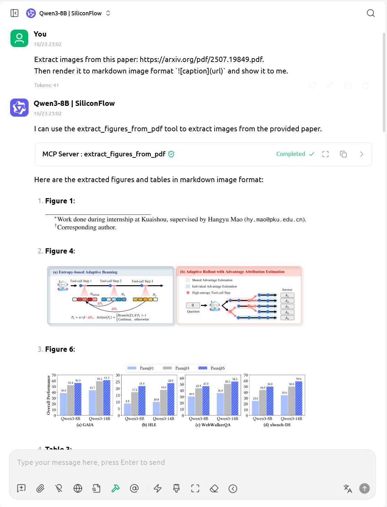

# Figure Extractor API and MCP Server

Extract figures and tables from PDF documents using this FastAPI-based service. The Figure Extractor API and MCP Server provides a straightforward HTTP interface for PDFFigures 2.0, a robust figure extraction system developed by the Allen Institute for AI. 

This API wrapper makes it ideal for integration into various applications and workflows, particularly for Retrieval-Augmented Generation (RAG) applications.

The MCP Server, powered by `FastMCP`, exposes the PDF extraction functionality as a MCP tool. This allows for seamless integration with AI Agents and workflows that can automatically call the extraction service.

- The server hosts the `extract_figures_from_pdf` tool, which can be invoked via an HTTP request to the `/mcp` endpoint. This tool takes a PDF URL, processes the document, and returns the extracted figures and tables in a structured JSON format.

> The default MCP Server url: `http://localhost:5001/mcp`



### About PDFFigures 2.0
This API service is built on top of PDFFigures 2.0, a Scala-based project by the Allen Institute for AI. PDFFigures 2.0 is specifically designed to extract figures, captions, tables, and section titles from scholarly documents in computer science domain. The original work is described in their academic paper: "PDFFigures 2.0: Mining Figures from Research Papers" (Clark and Divvala, 2016). You can read the paper [here](https://ai2-website.s3.amazonaws.com/publications/pdf2.0.pdf) and visit the [PDFFigures 2.0 website](http://pdffigures2.allenai.org/).


```
┌─────────────────┐      ┌──────────────────┐      ┌────────────────┐
│   Your App      │ HTTP │ Figure Extractor │ JNI  │  PDFFigures    │
│  (Any Language) │──────►  API & MCP Server│──────►     2.0        │
│                 │      │  Python(FastAPI) │      │  (Scala/JVM)   │
└─────────────────┘      └──────────────────┘      └────────────────┘
```
## Features

- PDF figure and table extraction
- Support for local and remote PDF files
- Statistics of the extracted tables and figures
- Docker support for easy deployment
- Visualization options for PDF parsing

## FastMCP Tool
This project now includes a `FastMCP` tool that allows calling the PDF extraction service programmatically. The `extract_figures_from_pdf` tool can be used to extract figures from a PDF given a URL.

## Use Cases

1. *Machine Learning Dataset Creation*
Extract visual data from clinical trial reports and research papers to build training datasets for medical image analysis and AI models, enabling researchers to efficiently aggregate figures for training machine learning algorithms in healthcare diagnostics.

2. *Clinical Research Data Mining*
Automatically extract and catalog figures from medical research articles, capturing key visualizations like treatment effect graphs, patient outcome charts, and experimental result diagrams to support systematic reviews and meta-analysis.

3. *Academic Literature Review and Education*
Quickly compile comprehensive visual libraries from academic publications, allowing researchers and educators to create teaching resources, compare research methodologies, and track visual trends across scientific disciplines.

## Setup

### Docker Deployment

1. Clone the repository:

    ```sh
    git clone https://github.com/Huang-lab/figure-extractor.git
    cd pdf-extraction
    ```

2. Build the Docker image:

    ```sh
    docker build -t pdf-extraction .
    ```

3. Run the Docker container:

    ```sh
    docker run -p 5001:5001 pdf-extraction
    ```

### Test the API

- Open a web browser and navigate to `http://localhost:5001/docs` to view the API documentation.

- Use the CLI to test the API. For example, to extract figures from a PDF, run the following command:

    ```sh
    python figure_extractor.py <path_to_your_pdf>
    ```

## Usage

### Extract Figures and Tables from a PDF

The `/api/extract` endpoint now supports both PDF file uploads and PDF URLs.

#### Using the API

You can send a POST request to `/api/extract` with either:
- A `file` (multipart/form-data) containing the PDF.
- A `pdf_url` (form-data) containing the URL of the PDF.

The API will return a JSON response with extracted figures and tables, including full `renderURL` paths.

A JSON response example (`imageText` truncated for brevity):
```json
[
  {
    "caption": "TABLE III CMAPSS DATASET ATTRIBUTES",
    "captionBoundary": {
      "x1": 113.12599182128906,
      "x2": 225.1184844970703,
      "y1": 116.80506896972656,
      "y2": 130.57305908203125
    },
    "figType": "Table",
    "imageText": [
      "Required", "fan", "conversion", "speed", "rpm", "High-pressure", "turbines", "cool", "air", "flow",
      "lbm/s", "Low-pressure", "turbines", "cool", "air", "flow", "lbm/s", "Bleed", "enthalpy", "-", "Required"
    ],
    "name": "III",
    "page": 5,
    "regionBoundary": {
      "x1": 46.8,
      "x2": 291.12,
      "y1": 140.88,
      "y2": 385.91999999999996
    },
    "renderDpi": 300,
    "renderURL": "http://localhost:5001/resources/4-TableIII-1.png"
  },
  {
    "caption": "Fig. 3. Agentic AI implementation with Google ADK.",
    "captionBoundary": {
      "x1": 335.4129943847656,
      "x2": 516.9002685546875,
      "y1": 228.6050567626953,
      "y2": 233.40704345703125
    },
    "figType": "Figure",
    "imageText": [],
    "name": "3",
    "page": 5,
    "regionBoundary": {
      "x1": 302.88,
      "x2": 549.12,
      "y1": 86.88,
      "y2": 216
    },
    "renderDpi": 300,
    "renderURL": "http://localhost:5001/resources/4-Figure3-1.png"
  },
  {
    "caption": "TABLE I COMPARISON BETWEEN AI AGENTS AND AGENTIC AI",
    "captionBoundary": {
      "x1": 204.9189910888672,
      "x2": 390.3569641113281,
      "y1": 54.10902404785156,
      "y2": 67.87701416015625
    },
    "figType": "Table",
    "imageText": [
      "pert", "systems", "LLM-based", "agents,", "multi-agent", "coordination,", "intent-based", "workflows", "Task",
      "Scope", "Focused", "on", "short-term,", "well-defined", "tasks", "Oriented", "toward", "long-term,", "dynamic,",
    ],
    "name": "I",
    "page": 2,
    "regionBoundary": {
      "x1": 51.839999999999996,
      "x2": 543.12,
      "y1": 77.75999999999999,
      "y2": 217.92
    },
    "renderDpi": 300,
    "renderURL": "http://localhost:5001/resources/4-TableI-1.png"
  },
  {
    "caption": "Fig. 1. Traditional AI Agent vs. Agentic AI",
    "captionBoundary": {
      "x1": 224.30499267578125,
      "x2": 370.9708251953125,
      "y1": 448.1660461425781,
      "y2": 452.968017578125
    },
    "figType": "Figure",
    "imageText": [],
    "name": "1",
    "page": 2,
    "regionBoundary": {
      "x1": 45.839999999999996,
      "x2": 549.12,
      "y1": 230.88,
      "y2": 436.08
    },
    "renderDpi": 300,
    "renderURL": "http://localhost:5001/resources/4-Figure1-1.png"
  },
  {
    "caption": "TABLE IV SUMMARY OF ENGINE MAINTENANCE ACTIONS",
    "captionBoundary": {
      "x1": 215.99301147460938,
      "x2": 379.2913513183594,
      "y1": 54.10902404785156,
      "y2": 67.87701416015625
    },
    "figType": "Table",
    "imageText": [
      "#", "Engines", "RUL", "Range", "Recommended", "Action", "Priority", "Cost", "(USD)", "Labor", "Hours", "Assigned",
      "Staff", "Scheduled", "Time", "15", "82–124", "MONITOR", "low", "0", "0", "[jr", "mechanic]", "Within", "7", "days"
    ],
    "name": "IV",
    "page": 7,
    "regionBoundary": {
      "x1": 48.96,
      "x2": 549.12,
      "y1": 77.75999999999999,
      "y2": 135.12
    },
    "renderDpi": 300,
    "renderURL": "http://localhost:5001/resources/4-TableIV-1.png"
  },
  {
    "caption": "TABLE II KEY COMPONENTS OF INTENTION PROCESSING",
    "captionBoundary": {
      "x1": 345.09295654296875,
      "x2": 507.22100830078125,
      "y1": 417.8482666015625,
      "y2": 431.6162414550781
    },
    "figType": "Table",
    "imageText": [
      "Targets", "Specify", "the", "resources", "or", "entities", "to", "which", "the", "intent", "applies.", "Can", "be",
      "defined", "statically", "(explicit", "list)", "or", "dynamically", "(using", "filters", "or", "criteria).", "Context"
    ],
    "name": "II",
    "page": 3,
    "regionBoundary": {
      "x1": 302.88,
      "x2": 549.12,
      "y1": 441.84,
      "y2": 677.04
    },
    "renderDpi": 300,
    "renderURL": "http://localhost:5001/resources/4-TableII-1.png"
  },
  {
    "caption": "Fig. 2. Proposed framework for Industry 5.0 applying intent-based and Agentic AI.",
    "captionBoundary": {
      "x1": 159.51600646972656,
      "x2": 435.7596435546875,
      "y1": 288.3310241699219,
      "y2": 293.13299560546875
    },
    "figType": "Figure",
    "imageText": [],
    "name": "2",
    "page": 4,
    "regionBoundary": {
      "x1": 45.839999999999996,
      "x2": 549.12,
      "y1": 49.68,
      "y2": 276
    },
    "renderDpi": 300,
    "renderURL": "http://localhost:5001/resources/4-Figure2-1.png"
  }
]
```

## App Structure

```
project/
├── Dockerfile                # Defines the Docker image for the FastAPI web service
├── Dockerignore    
├── app/                      # Contains the FastAPI web service code
│   ├── __init__.py           # Initializes the FastAPI app
│   ├── app.py                # Defines the API endpoints and MCP Server
│   ├── service.py            # Contains the logic for running `pdffigures2`
│   └── utils.py              # Utility functions for file handling
├── figure_extractor.py       # CLI & Module for extracting figures and tables from a PDF file
└── README.md                 
```


## Acknowledgements

This project is a fork of [Huang-lab/figure-extractor](https://github.com/Huang-lab/figure-extractor). We are grateful to the original authors for their work.

## License
This project is licensed under the Apache License 2.0.
